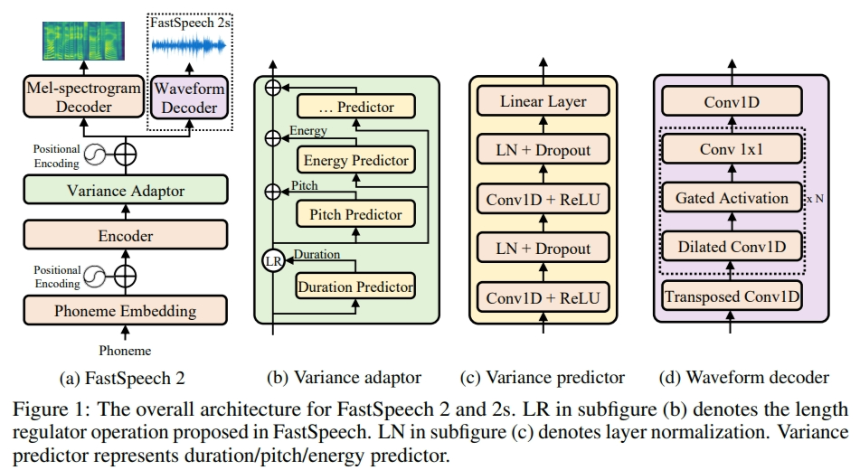

# FastSpeech 2 - PyTorch Implementation

This is a PyTorch implementation of Microsoft's text-to-speech system [**FastSpeech 2: Fast and High-Quality End-to-End Text to Speech**](https://arxiv.org/abs/2006.04558v1). 
This project is based on [xcmyz's implementation](https://github.com/xcmyz/FastSpeech) of FastSpeech. Feel free to use/modify the code.

There are several versions of FastSpeech 2.
This implementation is more similar to [version 1](https://arxiv.org/abs/2006.04558v1), which uses F0 values as the pitch features.
On the other hand, pitch spectrograms extracted by continuous wavelet transform are used as the pitch features in the [later versions](https://arxiv.org/abs/2006.04558).



# Updates
- 2021/07/8: Release the checkpoint and audio samples of a multi-speaker English TTS model trained on LibriTTS
- 2021/02/26: Support English and Mandarin TTS
- 2021/02/26: Support multi-speaker TTS (AISHELL-3 and LibriTTS)
- 2021/02/26: Support MelGAN and HiFi-GAN vocoder
- 2022/10/18: Support GST
- 2022/11/05: Support KSS Dataset (Korean-Single-Speaker)

# Todo List
- [ ] KSS + G2pk
- [ ] AI-Hub_Multi_Speaker

# Quickstart

## Dependencies
You can install the Python dependencies with
```
pip3 install -r requirements.txt
```

## Inference

You have to download the [pretrained models](https://drive.google.com/drive/folders/1DOhZGlTLMbbAAFZmZGDdc77kz1PloS7F?usp=sharing) and put them in ``output/ckpt/LJSpeech/``,  ``output/ckpt/AISHELL3``, or ``output/ckpt/LibriTTS/``, or ``output/ckpt/VCTK``.

For English single-speaker TTS, run
```
python3 synthesize.py --text "YOUR_DESIRED_TEXT" --restore_step 200000 --mode single --dataset LJSpeech
```

For English Multi-speaker TTS, run
```
python3 synthesize.py --text "YOUR_DESIRED_TEXT" --restore_step 1000000 --mode single --dataset VCTK
```

The generated utterances will be put in ``output/result/``.

Here is an example of synthesized mel-spectrogram of the sentence "Printing, in the only sense with which we are at present concerned, differs from most if not from all the arts and crafts represented in the Exhibition", with the English single-speaker TTS model.  


## Batch Inference
Batch inference is also supported, try

```
python3 synthesize.py --source preprocessed_data/LJSpeech/val.txt --restore_step 900000 --mode batch -p config/LJSpeech/preprocess.yaml -m config/LJSpeech/model.yaml -t config/LJSpeech/train.yaml
```
to synthesize all utterances in ``preprocessed_data/LJSpeech/val.txt``

## Controllability
The pitch/volume/speaking rate of the synthesized utterances can be controlled by specifying the desired pitch/energy/duration ratios.
For example, one can increase the speaking rate by 20 % and decrease the volume by 20 % by

```
python3 synthesize.py --text "YOUR_DESIRED_TEXT" --restore_step 900000 --mode single -p config/LJSpeech/preprocess.yaml -m config/LJSpeech/model.yaml -t config/LJSpeech/train.yaml --duration_control 0.8 --energy_control 0.8
```

# Training

## Datasets

The supported datasets are

- [LJSpeech](https://keithito.com/LJ-Speech-Dataset/): a single-speaker English dataset consists of 13100 short audio clips of a female speaker reading passages from 7 non-fiction books, approximately 24 hours in total.
- [AISHELL-3](http://www.aishelltech.com/aishell_3): a Mandarin TTS dataset with 218 male and female speakers, roughly 85 hours in total.
- [LibriTTS](https://research.google/tools/datasets/libri-tts/): a multi-speaker English dataset containing 585 hours of speech by 2456 speakers.
- [VCTK](https://datashare.ed.ac.uk/handle/10283/3443): The CSTR VCTK Corpus includes speech data uttered by 110 English speakers (multi-speaker TTS) with various accents. Each speaker reads out about 400 sentences, which were selected from a newspaper, the rainbow passage and an elicitation paragraph used for the speech accent archive.
- [KSS](https://www.kaggle.com/datasets/bryanpark/korean-single-speaker-speech-dataset): KSS Dataset is designed for the Korean text-to-speech task. It consists of audio files recorded by a professional female voice actoress and their aligned text extracted from my books.

We take LJSpeech as an example hereafter.

## Preprocessing

- For a **multi-speaker TTS** with external speaker embedder, download [ResCNN Softmax+Triplet pretrained model](https://drive.google.com/file/d/1F9NvdrarWZNktdX9KlRYWWHDwRkip_aP) of [philipperemy's DeepSpeaker](https://github.com/philipperemy/deep-speaker) for the speaker embedding and locate it in `./deepspeaker/pretrained_models/`.
- Run 
  ```
  python3 prepare_align.py --dataset DATASET
  ```
  for some preparations.

  For the forced alignment, [Montreal Forced Aligner](https://montreal-forced-aligner.readthedocs.io/en/latest/) (MFA) is used to obtain the alignments between the utterances and the phoneme sequences.
  Pre-extracted alignments for the datasets are provided [here](https://drive.google.com/drive/folders/1fizpyOiQ1lG2UDaMlXnT3Ll4_j6Xwg7K?usp=sharing). 
  You have to unzip the files in `preprocessed_data/DATASET/TextGrid/`. Alternately, you can [run the aligner by yourself](https://montreal-forced-aligner.readthedocs.io/en/latest/user_guide/workflows/index.html).

  MFA Setting
  ```
  conda create -n mfa -c conda-forge montreal-forced-aligner python=3.8
  ```

  MFA Training
  ```
  conda activate mfa
  ```
  ```
  python3 prepare_mfa.py --dataset DATASET
  ```

  After that, run the preprocessing script by
  ```
  python3 preprocess.py --dataset DATASET
  ```

## Training

Train your model with
```
python3 train.py --dataset DATASET
```
Useful options:
- To use a [Automatic Mixed Precision](https://pytorch.org/tutorials/recipes/recipes/amp_recipe.html), append `--use_amp` argument to the above command.
- The trainer assumes single-node multi-GPU training. To use specific GPUs, specify `CUDA_VISIBLE_DEVICES=<GPU_IDs>` at the beginning of the above command.

# TensorBoard

Use
```
tensorboard --logdir output/log/LJSpeech
```

to serve TensorBoard on your localhost.
The loss curves, synthesized mel-spectrograms, and audios are shown.


# Implementation Issues

- Following [xcmyz's implementation](https://github.com/xcmyz/FastSpeech), I use an additional Tacotron-2-styled Post-Net after the decoder, which is not used in the original FastSpeech 2.
- Gradient clipping is used in the training.
- In my experience, using phoneme-level pitch and energy prediction instead of frame-level prediction results in much better prosody, and normalizing the pitch and energy features also helps. Please refer to ``config/README.md`` for more details.

Please inform me if you find any mistakes in this repo, or any useful tips to train the FastSpeech 2 model.

# References
- [ming024's FastSpeech2](https://github.com/ming024/FastSpeech2)
- [keonlee9420's Comprehensive-E2E-TTS](https://github.com/keonlee9420/Comprehensive-E2E-TTS)
